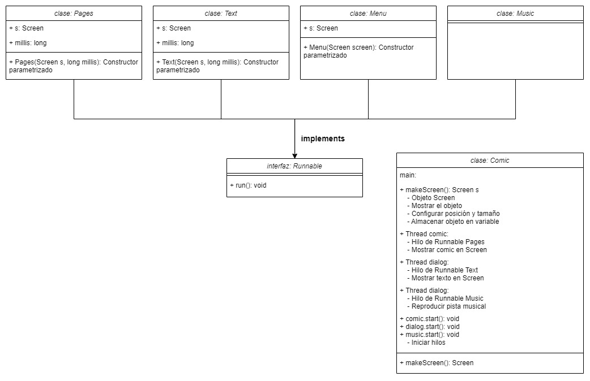
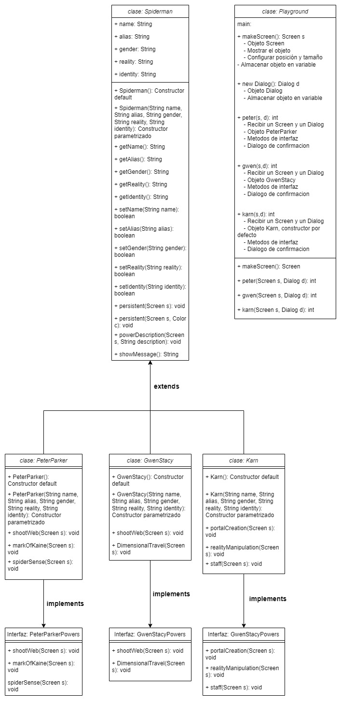
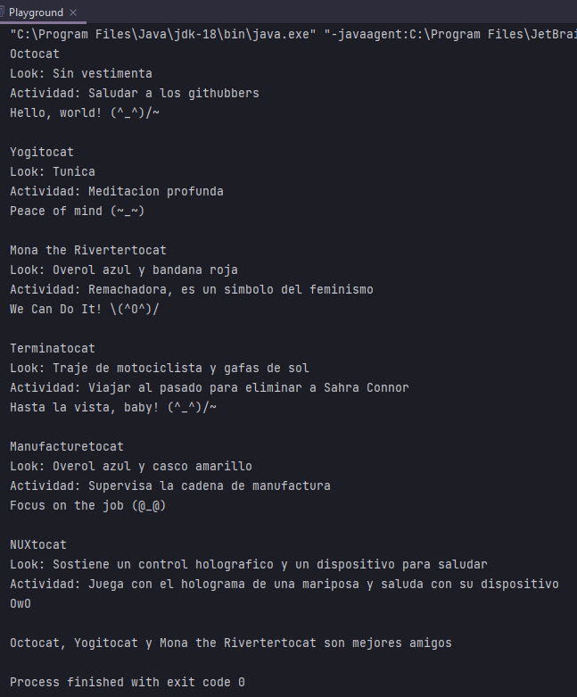
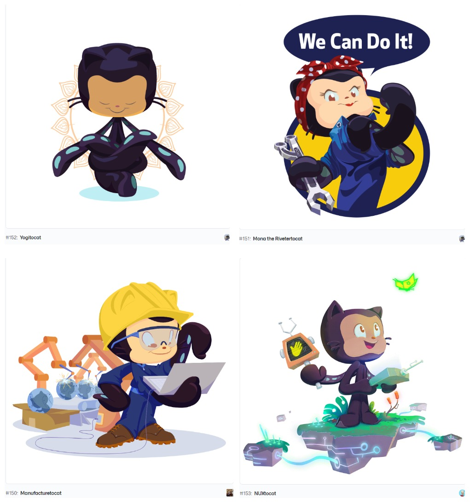
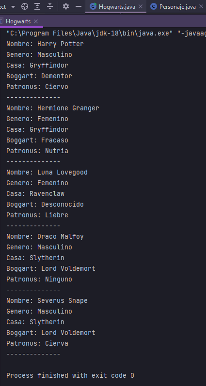
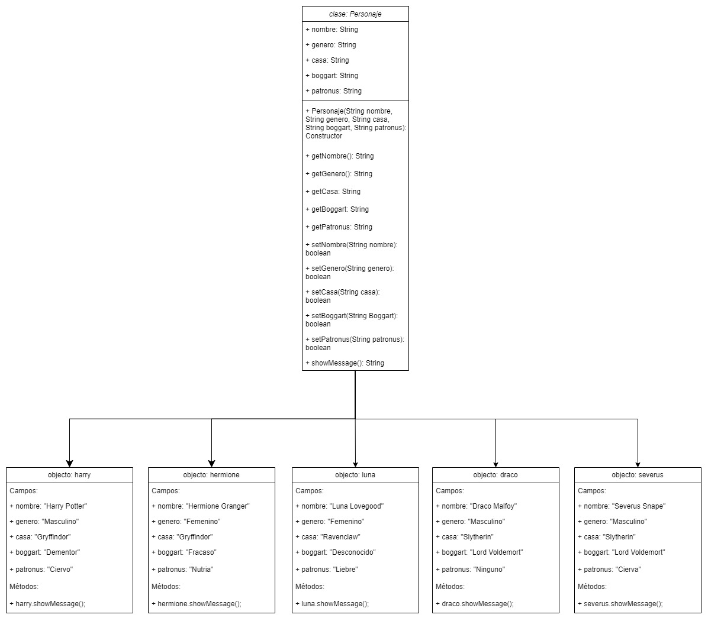

# BackEnd JAVA

¡Saludos, muchas gracias por interesarte en mi trabajo!

Puse mucha dedicación, pensamiento y tiempo en hacer estas prácticas y tambien en redactar y estructurar este README para que fuera fácil de entender y muy vistoso. Eres libre de revisar mi código y quizas inspirarte en él para hacer tus propios proyectos, o incluso usar la estructura de este README para hacer el tuyo. Solo te pido un pequeñisimo favor :pray:, si algo de aquí te resultó útil hazme una pequeña mención, este es mi usuario de github: https://github.com/RicardoJCruz/backend-java/edit/main/README.md.

¡Muchas gracias y mucha suerte!

## Práctica Concierto (Multihilos)

README PROXIMAMENTE: DESCRIPCIÓN, DIAGRAMAS, VIDEO, CREDITOS
APP PROXIMAMENTE: IMPRIMIR INFORMACIÖN DEL CONCIERTO A TEXTO, AÑADIR MUSICA


Video completo de la ejecución del programa: https://vimeo.com/702654812: https://vimeo.com/703989893 Será actualizado


## Práctica Cómic (Hilos)

Visualizador de páginas de un cómic y dialogos por página con música de fondo.

Al ejecutarse se crea una ventana que recorre las páginas de un cómic, al mismo tiempo en otra ventana se escriben los diálogos correspondientes a la página en turno, y una pista musical se reproduce durante toda la duración del cómic.

### Ejecución


Video completo de la ejecución del programa: https://vimeo.com/702654812

**¡IMPORTANTE!**

Este proyecto hace uso del framework `inmosh`, el cual no está disponible públicamente.

Este proyecto hace uso de la libreria `play-mp3-java` que puede ser encontrada aquí: https://github.com/manjurulhoque/play-mp3-java

Para que el programa reconozca las funciones del framework inmosh los archivos de código fuente (.java) deben estar directamente en la carpeta "src", afuera de cualquier paquete.

Este programa requiere el archivo `Eternity.mp3` localizado en la carpeta "src" (renombrada como "practicaComic para subirse a este repositorio"). dicho archivo no está incluido en este repositorio por temas de derechos de autor. Para que el programa funcione correctamente se debe agregar un archivo de audio `mp3` nombrado "Eternity.mp3" en la carpeta src de este proyecto.

Este programa requiere 46 imagenes contenidas en una carpeta llamada "img" que se encuentra en el folder del proyecto, dicha carpeta no esta incluida por temas de derechos de autor. Para que el programa funcione correctamente se debe crear una carpeta llamada "img" en la carpeta raíz del proyecto y agregar imagenes con los siguientes nombres:

```
page (1).png
[...]
page (46).png
```
--------

Existe una `clase Menu()` que pretendía ofrecer varias opciones al usuario para controlar la reproducción del comic, pero debido a su innecesaria complejidad para efectos de esta práctica se dejó incompleta. Esta clase, que extiende de `Runnable`, puede ser utilizada en el `Main` del programa.

### Diagrama


**Créditos:**

FREE COMIC BOOK DAY 2021 SPIDER-MAN/VENOM # 1

Música: Eternity by [Martin Peralta](https://www.youtube.com/shorts/uVCq_eiV3hc)

framework inmosh proporcionado por [FernandaOchoa](https://github.com/FernandaOchoa)

play-mp3-java by [manjurulhoque](https://github.com/manjurulhoque/play-mp3-java)

Java app by [RicardoJCruz](https://github.com/RicardoJCruz/)

## Práctica Spiderverse (Interfaces)

Modelado de 3 personajes del Spiderverse.

Al ejecutarse el programa despliega una ventana con la información de un personaje y la descripción de uno de sus superpoderes, un cuadro de dialogo permite avanzar al siguiente superpoder hasta llegar al último personaje.

### Ejecución


En el cuadro de dialogo si se presiona el botón "No" ó el botón "Cancel" el programa termina y se cierra.

**¡IMPORTANTE!**

Este proyecto hace uso del framework `inmosh`, el cual no está disponible públicamente.

Para que el programa reconozca las funciones del framework inmosh los archivos de código fuente (.java) deben estar directamente en la carpeta "src", afuera de cualquier paquete.

Este programa requiere varias imagenes contenidas en una carpeta llamada "img" que se encuentra en el folder del proyecto, dicha carpeta no esta incluida por temas de derechos de autor. Para que el programa funcione correctamente se debe crear una carpeta llamada "img" en la carpeta raíz del proyecto y agregar imagenes con los siguientes nombres:

```
gs-dimensional-travel.jpg
gs-web-shoot.jpg
karn-portal.jpeg
karn-reality-manipulation1.jpg
karn-staff1.jpg
pp-mark-og-kaine.jpg
pp-shoot-web.jpg
pp-spider-sense.jpg
```
--------

[Clase Spiderman](./practicaMultiverse/Spiderman.java)

[Clase PeterParker](./practicaMultiverse/PeterParker.java) Clase que extiende de la clase Spiderman e implementa a la clase PeterParkerPowers. Existen otras dos clases como esta para otros personajes.

[Interfez PeterParkerPowers](./practicaMultiverse/PeterParkerPowers.java) Existen otras dos clases como esta para otros personajes.

[Clase Main](./practicaMultiverse/Play.java)

Fuente de la informacion de los personajes:
https://marvel.fandom.com/wiki/Marvel_Database

### Diagrama


## Práctica Mona (Herencia y polimorfismo)

Modelado de seis personajes Octocat que extienden de una clase Octocat.

### Ejecución


[Clase Octocat](./practicaMona/Octocat.java)

[Clase Nuxtocat](./practicaMona/Nuxtocat.java) una de las clases que extiende de Octocat

[Clase Main](./practicaMona/Playground.java)

El método `mejoresAmigos()` recibe 3 `objetos Octocat`, en `Main` se les puede pasar instancias de la `clase Octocat` e instancias de clases que extiendan de la `clase Octocat`. Esto es Polimorfismo de subtipo.
```Java
public static void main(String[] args) {
    // Subtype polymorphism
    mejoresAmigos(new Octocat(), new Yogitocat(), new Rivertertocat());
}

// Subtype polymorphism
static void mejoresAmigos(Octocat obj1, Octocat obj2, Octocat obj3) {
    System.out.println(obj1.getNombre() + ", " + obj2.getNombre() + " y " + obj3.getNombre() + " son mejores amigos");
}
```

**Personajes utilizados**

Modelé las clases para 4 personajes octocat que extienden de la `clase Octocat` y cada una tiene una instancia en `Main`, los otros dos Octocats que aparecen en `Main` (Octocat y Terminatocat) son instancias de la `clase Octocat`.

Fuente: https://octodex.github.com/



### Diagrama


## Práctica Harry (Modelado)

Modelado de 5 personajes de la saga Harry Potter. Las instancias se definen por un constructor o por setters y getters.

### Ejecución


[Clase Personaje](./practicaHarry/Personaje.java)

[Clase Main](./practicaHarry/Hogwarts.java)

### Diagrama

