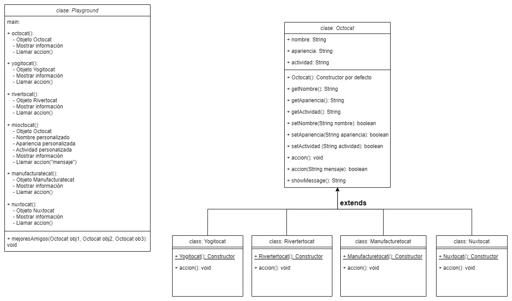

# BackEnd JAVA

## Práctica Harry (Modelado)

[Clase Personaje](./practicaHarry/Personaje.java)

[Clase Main](./practicaHarry/Hogwarts.java)

### Diagrama


### Ejecución


## Práctica Mona (Herencia y polimorfismo)

[Clase Octocat](./practicaMona/Octocat.java)

[Clase Nuxtocat](./practicaMona/Nuxtocat.java) una de las clases que extiende de Octocat

[Clase Main](./practicaMona/Playground.java)

El método mejoresAmigos recibe 3 objetos Octocat, en Main se les puede pasar instancias de la clase Octocat e instancias de clases que extiendan de la clase Octocat. Esto es Polimorfismo de subtipo.
```
public static void main(String[] args) {
    // Subtype polymorphism
    mejoresAmigos(new Octocat(), new Yogitocat(), new Rivertertocat());
}

// Subtype polymorphism
static void mejoresAmigos(Octocat obj1, Octocat obj2, Octocat obj3) {
    System.out.println(obj1.getNombre() + ", " + obj2.getNombre() + " y " + obj3.getNombre() + " son mejores amigos");
}
```

**Personajes utilizados**

Modelé las clases para 4 personajes octocat que extienden de la clase Octocat y cada una tiene una instancia en Main, los otros dos Octocats que aparecen en Main (Octocat y Terminatocat) son instancias de la clase Octocat.


### Diagrama


### Ejecución


## Práctica Spiderverse (Interfaces)

**¡IMPORTANTE!** Para que el programa reconozca las frunciones del framework inmosh los archivos de código fuente (.java) deben estar directamente en la carpeta "src", afuera de cualquier paquete.

[Clase Spiderman](./practicaMultiverse/Spiderman.java)

[Clase PeterParker](./practicaMultiverse/PeterParker.java) Clase que extiende de la clase Spiderman e implementa a la clase PeterParkerPowers. Existen otras dos clases como esta para otros personajes.

[Interfez PeterParkerPowers](./practicaMultiverse/PeterParkerPowers.java) Existen otras dos clases como esta para otros personajes.

[Clase Main](./practicaMultiverse/Play.java)

Fuente de la informacion de los personajes:
https://marvel.fandom.com/wiki/Marvel_Database

### Diagrama


### Ejecución


En el cuadro de dialogo si se presiona el botón "No" ó el botón "Cancel" el programa termina y se cierra.
